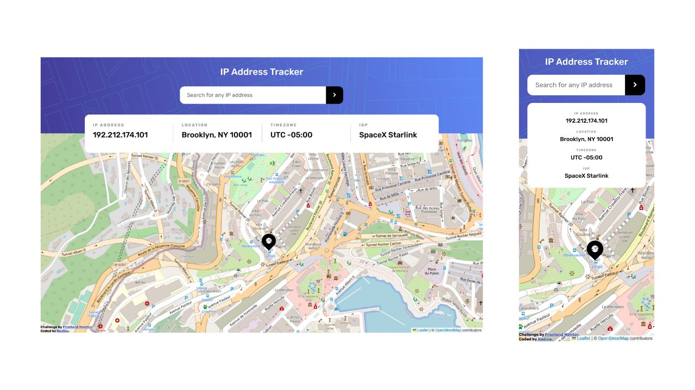

# Frontend Mentor - IP address tracker solution, using NextJS

This is a solution to the [IP address tracker challenge on Frontend Mentor](https://www.frontendmentor.io/challenges/ip-address-tracker-I8-0yYAH0). Frontend Mentor challenges help you improve your coding skills by building realistic projects.

I chose NextJS because of its API routes feature, in order to prevent my API key to be exposed in the front end.

NB: My solution is limited to IP v4 searches, because it is the easiest to validate without third party modules :-)

NB2: 2 API providers are implemented:

- [ipify IP Geolocation API](https://geo.ipify.org/), which is indicated by Frontend Mentor,
- [ipgeolocation API](https://ipgeolocation.io/), which I added because its free plan (periodic quota renewal) is best suited for this project.

## Table of contents

- [Overview](#overview)
  - [The challenge](#the-challenge)
  - [Screenshot](#screenshot)
  - [Links](#links)
- [My process](#my-process)
  - [Built with](#built-with)
  - [What I learned](#what-i-learned)
  - [Useful resources](#useful-resources)
- [Author](#author)

## Overview

### The challenge

Users should be able to:

- View the optimal layout for each page depending on their device's screen size
- See hover states for all interactive elements on the page
- See their own IP address on the map on the initial page load
- Search for any IP addresses or domains and see the key information and location

### Screenshot

### Links

- Solution URL: [https://github.com/nadlgit/fmchallenge-ip-address-tracker](https://github.com/nadlgit/fmchallenge-ip-address-tracker)
- Live Site URL: [https://nadl-fmchallenge-ip-address-tracker.netlify.app](https://nadl-fmchallenge-ip-address-tracker.netlify.app)

## My process

### Built with

- [React](https://reactjs.org/) and [Next.js](https://nextjs.org/), bootstrapped with [`create-next-app`](https://github.com/vercel/next.js/tree/canary/packages/create-next-app)
- [Leaflet](https://leafletjs.com/) through [React Leaflet](https://react-leaflet.js.org/)
- Responsive, mobile-first workflow
- Semantic HTML5 markup
- [CSS modules](https://github.com/css-modules/css-modules)
- CSS grid and flexbox
- CSS custom properties
- [React-Toastify](https://github.com/fkhadra/react-toastify)
- Tested with [Jest](https://jestjs.io/), [Testing Library](https://testing-library.com/) and [MSW - Mock Service Worker](https://mswjs.io/)

### What I learned

This is my first project with NextJS so I learnt a lot about the framework.

I had a rough time implementing the map with React Leaflet, and I succeeded thanks to the resources below.

On the CSS side, I tried to be fully responsive, by making font sizes and so on scale progressively.

### Useful resources

- [Integrating Next.js with Leaflet.js + Mapbox](https://dev.to/tsaxena4k/integrating-next-js-with-leaflet-js-mapbox-1351) - This article gave me the steps to use React Leaflet in a NextJS application, such as dynamic import or the workaround to display Leaflet default icons.

- [Map <Marker> image does not appear on Next.js](https://github.com/PaulLeCam/react-leaflet/issues/808#issuecomment-977109769) - This comment on React Leaflet issue showed me that, for custom icon in NextJS, `src` attribute is needed.

- [React leaflet center attribute does not change when the center state changes](https://stackoverflow.com/questions/64665827/react-leaflet-center-attribute-does-not-change-when-the-center-state-changes/64667351#64667351) - This comment explains that React Leaflet MapContainer props are immutable, so you need to access the underlying map object and use its methods, such as `setView` or `flyTo`.

## Author

- Frontend Mentor - [@nadlgit](https://www.frontendmentor.io/profile/nadlgit)
